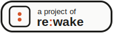

<a id="readme-top"></a>

<br />
<div align="center">
  <a href="https://rewake.org">
    
  </a>

  <h3 align="center">re:wake</h3>

  <p align="center">
    Small, focused tools that do one thing and do it right.
    <br />
    <a href="https://rewake.org"><strong>Visit the site »</strong></a>
    <br />
    <br />
  </p>
</div>

This repository holds the landing page for [rewake.org](https://rewake.org) — the site that links together the re:wake family of tools and documents what the project is about.

<details>
  <summary>Table of Contents</summary>
  <ol>
    <li><a href="#about-the-project">About The Project</a></li>
    <li><a href="#design-principles">Design principles</a></li>
    <li><a href="#branding">Branding</a></li>
    <li>
      <a href="#getting-started">Getting Started</a>
      <ul>
        <li><a href="#local-preview">Local preview</a></li>
        <li><a href="#adding-a-new-project">Adding a new project</a></li>
      </ul>
    </li>
    <li><a href="#deployment">Deployment</a></li>
    <li><a href="#contact">Contact</a></li>
  </ol>
</details>

## About The Project

re:wake is where Andreas's smaller projects live. Not every idea needs its own domain, landing page, and logo — some ideas are just small tools that solve one problem and then get out of the way. Instead of building a whole separate site around each one, these projects share a home here, each running under its own rewake.org subdomain.

The mission is simple: software that does one thing, and does it right. No accounts unless the tool actually needs to remember something about you, no frameworks bolted on for the sake of it, no feature creep — just a tool that works, loads fast, and doesn't ask much of you.

This repo is just the landing page and about page; each tool lives in its own repository and links back here.

<p align="right">(<a href="#readme-top">back to top</a>)</p>

### Built With

* [![HTML5][HTML5]][HTML5-url]
* [![CSS3][CSS3]][CSS3-url]
* [![GitHub Pages][GitHubPages]][GitHubPages-url]

<p align="right">(<a href="#readme-top">back to top</a>)</p>

## Design principles

- **One job per tool.** Each re:wake project solves a single problem. If a feature doesn't serve that one job, it doesn't ship.
- **No accounts, no lock-in.** Nothing requires sign-up unless the problem itself demands it (e.g. saving user data).
- **Lightweight by default.** No frameworks or dependencies unless they earn their weight. Fast load times over convenience.
- **Get out of the way.** The tool should be obvious and easy to use, and disappear once the job is done.

<p align="right">(<a href="#readme-top">back to top</a>)</p>

## Branding

- **Wordmark:** `re:wake`, always lowercase. The colon is the brand mark — style it in the accent color while `re` and `wake` stay in the body text color.
- **Colors:**

  | Token | Value | Use |
  |---|---|---|
  | `--bg` | `#fafaf9` | Page background |
  | `--fg` | `#1c1c1a` | Body text, wordmark |
  | `--muted` | `#6b6b66` | Secondary text |
  | `--accent` | `#d4552b` | Colon, links, "Visit" links |
  | `--border` | `#e5e4e0` | Card and divider borders |

  Defined as CSS custom properties in `css/style.css`
- **Typography:** system font stack (no web fonts), keeps pages fast and dependency-free.
- **Favicon:** the re:wake colon, rendered as two accent-colored dots on a light rounded tile (`assets/favicon.svg`) — the brand mark distilled to its simplest form, legible even at 16×16.
- **Badge:** `assets/badge.svg` — an "a project of re:wake" badge for individual project READMEs to link back here.

  

<p align="right">(<a href="#readme-top">back to top</a>)</p>

## Getting Started

### Local preview

```sh
git clone https://github.com/Mozzo1000/rewake.org.git
cd rewake.org
python -m http.server
```

Or just open `index.html` directly in a browser.

<p align="right">(<a href="#readme-top">back to top</a>)</p>

### Adding a new project

Copy this block into the `.project-grid` in `index.html`, fill in the details, and commit:

```html
<article class="project-card">
  <h3><a href="https://example.rewake.org">Project Name</a></h3>
  <p>One-sentence description of what it does.</p>
  <div class="card-links">
    <a class="visit-link" href="https://example.rewake.org">Visit →</a>
    <a class="source-link" href="https://github.com/Mozzo1000/repo-name">Source</a>
  </div>
</article>
```

If the project has its own repo, drop the [badge](#branding) in its README to link back here.

<p align="right">(<a href="#readme-top">back to top</a>)</p>

## Deployment

GitHub Pages is configured to serve from the root of the `main` branch, using the custom domain in `CNAME` (`rewake.org`). Make sure your DNS points at GitHub Pages if it doesn't already.

<p align="right">(<a href="#readme-top">back to top</a>)</p>

<!-- MARKDOWN LINKS & IMAGES -->
[HTML5]: https://img.shields.io/badge/HTML5-E34F26?style=for-the-badge&logo=html5&logoColor=white
[HTML5-url]: https://developer.mozilla.org/en-US/docs/Web/HTML
[CSS3]: https://img.shields.io/badge/CSS3-1572B6?style=for-the-badge&logo=css3&logoColor=white
[CSS3-url]: https://developer.mozilla.org/en-US/docs/Web/CSS
[GitHubPages]: https://img.shields.io/badge/GitHub%20Pages-222222?style=for-the-badge&logo=githubpages&logoColor=white
[GitHubPages-url]: https://pages.github.com/
